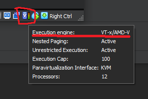
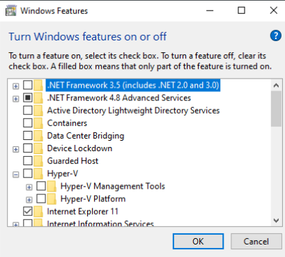
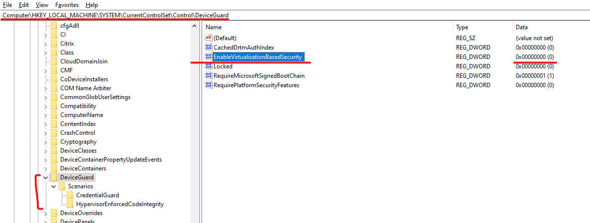
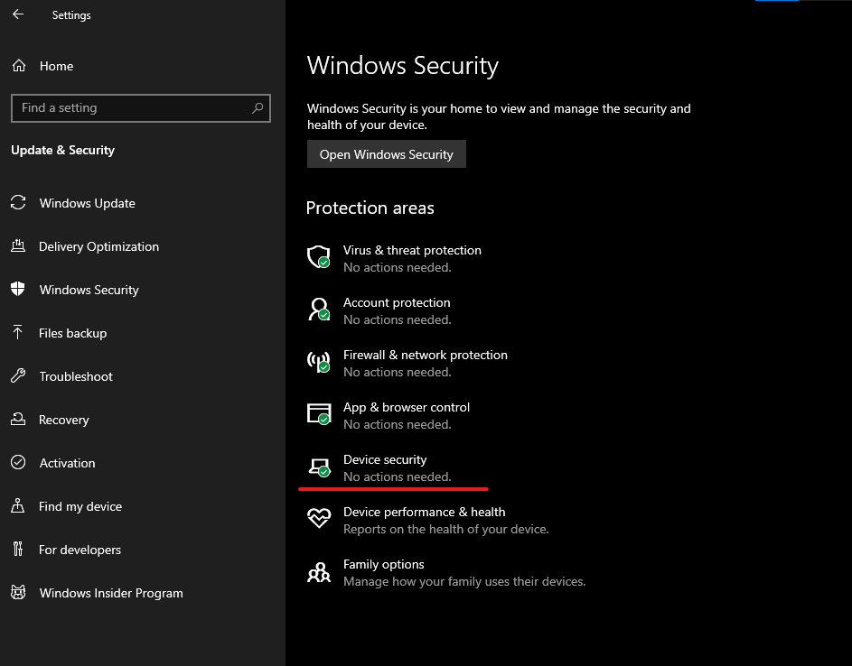
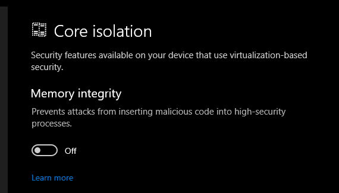
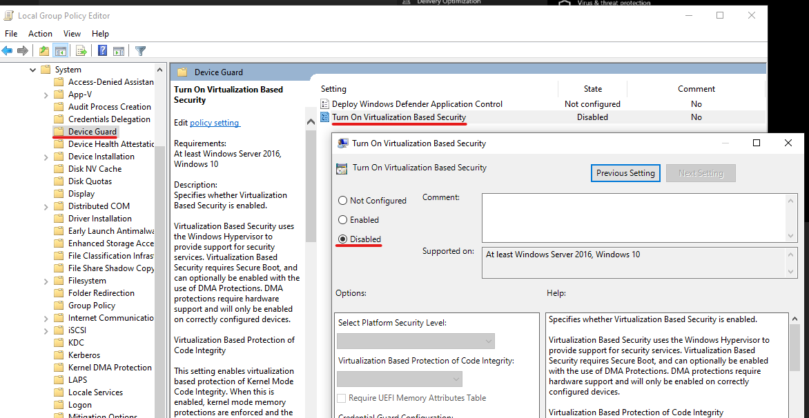
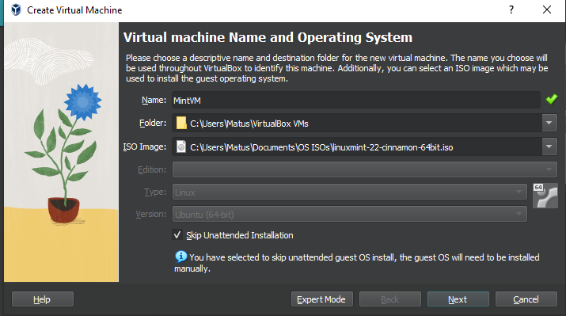
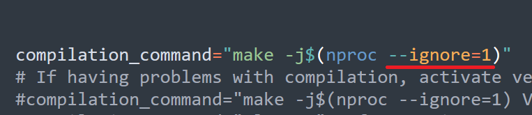
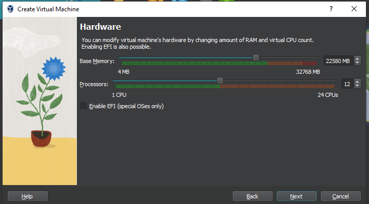
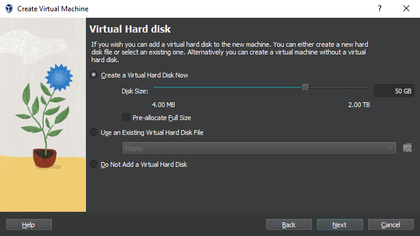

# Guia de compilacion del kernel 6.8.0 en una VM con Linux Mint

En esta guia se intentara cubrir todos los aspectos de compilar por primera vez un kernel, desde la configuracion del ambiente de desarrollo, hasta la instalacion del kernel compilado manualmente.

# Prerequisitos

A pesar de que esto es un pre-requisito. **PRIMERO DEBEN**  ir a la sección de **Configuración de VM**. Alli les explicare en que momento verificar si deben hacer la seccion de pre-requisitos o no.



Pueden obviar este segmento totalmente y continuar donde se quedaron de  **Configuración de VM**

## Hiper-V, AMD-V/VT-x y Virtual Box

Es importante hacer la nota del funcionamiento interno y de como VirtualBox logra su virtualización. Para no hacer esta sección larga y mantenernos en lo que concerne a los usos de la pratica de laboratorio de Sistemas Operativos 2, me reduciré a decir nada mas que Hypervysor (Hyper-V) interfieren con el funcionamiento correcto de VirtualBox. Podran observar virtualizaciones lentas incluso en computadoras decentes y de alta gama, si es que se cuenta con Hyper-V corriendo en la maquina host Windows (que de hecho, deja de ser el host cuando Hyper-V esta activado). Una manera simple de saber si esto es el caso para ustedes, podran notar un icono de una tortuga en la parte inferior derecha al correr su VM.


Otra manera más tecnica de ver si este es el caso para virutal box, es darle click derecho a la VM desde el selector de VMs, y seleccionar Show in Explorer. Ver la carpeta de logs el mas reciente, y buscar por los siguientes textos

```log
{timestamp} HM: HMR3Init: Attempting fall back to NEM: VT-x is not available
{timestamp} NEM: WHvCapabilityCodeHypervisorPresent is TRUE, so this might work...
```

o

```log
{timestamp} HM: HMR3Init: Attempting fall back to NEM: AMD-V is not available
{timestamp} NEM: WHvCapabilityCodeHypervisorPresent is TRUE, so this might work...
```

Esto significa que algun servicio esta haciendo uso de Hyper-V. Desactivar Hyper-V totalmente, no es tan facil como desactivarlo de la lista de Fetures de Windows. Por lo que a continuación hay pasos para asegurarse (en la medida de lo posible) que Hyper-V este desactivado.

Si necesitan tener activado Hyper-V(por Docker por ejemplo) por otro curso que llevaran, tienen dos opciones

- Correr VirtualBox en el modo lento (la opcion fea :( y lenta)

- Adentrarse como buenos ingenieros en sistemas en el siguiente [Instructivo](https://www.tenforums.com/tutorials/139405-run-hyper-v-virtualbox-vmware-same-computer.html) para activar/desactivar Hyper-V de manera necesaria segun el curso en el que esten trabajando en ese momento.

## 1. Desactivar Docker

A excepción de que vayan a llevar otro curso en vacaciones en el que lo vayan a necesitar, sugiero incluso desinstalarlo totalmente. Si lo necesitaran, por lo menos desactivar el inicio automatico del servicio y usarlo solamente cuando esten trabajando en el otro curso. Es casi asegurado que si el servicio de Docker está corriendo, tendran problemas con VBox corriendo en todo su potencial.

## 2. Desactivar Hyper-V

Como dicho anteriormente, este interfiere directamente con el funcionamiente de Docker.  Es recomendado desactivarlo desde "Activar o desactivar las características de Windows", o en ingles "Turn windows features on or off".

En este menu, aseguremonos de lo siguiente:

- Hyper-V: desactivado
  
  - Hyper-V Management Tools: **Desactivado**
  
  - Hyper-V Platform: **Desactivado**


Aunque realmente solo estos dos son necesarios, sirve tambien asegurarse de los siguientes extras:

- Virtual Machine Platform: **Activado**

- Windows Hypervisor Platform: **Activado**

- Windows Sandbox: **Desactivado**

Luego de esto, vamos a deshabilitarlo tambien desde comandos, como una medida extra. Desde un CMD de Administrador, correr lo siguiente:

```batch
bcdedit /set hypervisorlaunchtype off
DISM /Online /Disable-Feature:Microsoft-Hyper-V
```

## 3. DeviceGuard/CredentialGuard

Esto puede interferir directamente con Hyper-V de la misma manera que lo hace Hyper-V. En versiones Pro de Windows se puede desactivar a travez de gpedit.msc (Presiona W+R y escribe gpedit.msc y presiona enter) bajo la sección de Local *Local Computer Policy > Computer Configuration > Administrative Templates > System > Device Guard > Turn on Virtualization Based Security* y colocarlo en **Desactivado**. Si no esta presente en esta seccion, una alternativa es a travez del registro (Win+R, "regedit"), en la direccion *Computer\HKEY_LOCAL_MACHINE\SYSTEM\CurrentControlSet\Control\DeviceGuard*, **EnableVirtualizationBasedSecurity** en 0

CredentialGuard se rige bajo DeviceGuard, y eso deberia ser suficiente para desactivarlo, pero si quieren ser aun mas rigurosos, asegurarse que estas direcciones tambien esten en 0 (desactivado)

- *Computer\HKEY_LOCAL_MACHINE\SYSTEM\CurrentControlSet\Control\DeviceGuard\Scenarios\HypervisorEnforcedCodeIntegrity*,  **Enabled** en 0
- *Computer\HKEY_LOCAL_MACHINE\SYSTEM\CurrentControlSet\Control\DeviceGuard\Scenarios\CredentialGuard*,  **Enabled** en 0



## Integridad de memoria

Para maquinas corriendo en Windows 10, tambien es necesario desactivar algunas cosas de VBS (Virtualization Based Security). Ir a la app *Ajustes -> Actualizaciones y Seguridad -> Seguridad de Windows -> Seguridad del Dispositivo -> Detalles de aislamiento de núcleo* y desactivar **Integridad de Memoria**





Para ser extra precavidos, se puede desactivar VBS totalmente desde gpedit.msc en *Computer Configuration > Administrative Templates > System > Device Guard > Turn On Virtualization Based Security* y colocarlo como **Desactivado**



## Device Guard extras

Aparte de las llaves de registro mencionadas anteriormente, dependiendo de la version de Windows, puede que no las hayan encontrado alli, o tambien tengan que desactivar estas otras:

- **Computer\HKEY_LOCAL_MACHINE\SYSTEM\CurrentControlSet\Control\DeviceGuard\Scenarios\SystemGuard** en 0

En algunos BIOS, puede que exista una opcion llamada "Secured Core" que efectivamente habilita Hyper-V desde el nivel BIOS. Si luego de seguir todos los pasos, la VM les sigue corriendo con ese icono, les recomiendo buscar dentro de la configuracion de su BIOS dicha opcion, seguramente en alguna seccion de configuracion del CPU. Si con los pasos anteriores ya no les sale el icono de la tortuga, esto no es necesario.

## Reiniciar

**NOTA IMPORTANTE:** Luego de realizar los pasos en esta seccion. es IMPORTANTISIMO apagar totalmente la computadora con el siguiente comando:

```batch
shutdown -s -t 2
```

Luego de que la computadora se apague, desconectenla del poder durante 20 segundos. Luego vuelvan a conectarla y enciendanla. 

# Configuración de VM

## Descarga, instalacion y selección inicial

Ahora si, a centrarnos en especificamente lo necesario para el kernel. Luego de instalar y correr [VirtualBox](https://www.virtualbox.org/wiki/Downloads), y teniendo descargada [Linux Mint 22 Cinnamon](https://www.linuxmint.com/edition.php?id=316) (o la version Xfe). Vamos a crear una nueva VM. Vamos a colocarle cualquier nombre (en algun punto, quizas tengan que ejecutar un par de comandos con el nombre de la VM, asi que mejor si no tiene espacios ni caracteres especiales). Vamos a marcar "Skip unattended installation" en caso haya alguna opcion de la instalacion de Mint que necesitemos configurar a nuestro gusto, como lenguajes, metodos de entrada y otros.



## RAM y vCPUs

Esta sección no tiene una respuesta exacta. No hay una respuesta realmente correcta o universal de cuanta RAM o vCPUs asignar a la VM (empezando por la diversidad de computadoras que hay). Como consejo general, mantengase dentro de la zona verde que VirtualBox muestra para cada uno de los valores. Pueden ir jugando con estos valores si creen que pueden aprovechar un poco mas los recursos de la computadora. En caso de la RAM, los procesos de compilacion haran uso de la RAM segun lo necesiten y no es necesario especificarla (aunque mientras mas mejor). Como consejo general, se recomienda tener 1GB de RAM por cada job de compilacion. En otras palabras, por cada nucleo que asignemos a la compilacion, pensemos en 1GB de RAM. Si no es posible alojar tanta RAM, no hay problema. Siempre se puede hacer uso de Swap, y en lo general es mejor no limitar los nucleos y utilizar los que se puedan. En terminos de nucleos, haremos uso del comando "nproc" para dinamicamente asignar nucleos al proceso de compilacion, por lo que podemos modificar la cantidad de nucleos en la VM sin preocuparnos de modificar luego el proceso de compilacion tambien. Si la cantidad de nucleos (logicos) disponibles que seleccionen en la barra es menor o igual a 4, les sugiero posteriormente quitar la opcion --ignore=1 en el script de compilacion que les brindare. Esto porque la cantidad de nucleos es muy baja y queremos agilizar el proceso lo mas posible. Para personas que puedan seleccionar mas vCPUs en la barra, pueden dejar esta opcion si quieren mantener un poco mas de responsiveness en la VM mientras compilan (o pueden provar quitarlo y ver que tal les corre).

Mucho texto? No me explique muy bien? En resumen:

- Empiezen con el valor mas alto que esté en la barra verde en la seleccion de RAM y vCPUs

- Si Tienen 4 nucleos o menos, borren el argumento --ignore=1 en el script que usaremos mas adelante para compilar (compile_and_install.sh).



- Si usaran 4 o mas nucleos en la VM, es MUY recomendado que sigan la seccion de pre-requisitos al inicio de esta guia y se aseguren que su VM no corre en modo lento. Esto debido a que la sincronizacion de CPUs se puede relentizar de ser este el caso. Y mientras mas nucleos usen, el inicio de la VM cada vez que reinicien sera lento. Muy. Lento. Dolorsamente lento.

Siguiendo estos consejos, la configuracion que elegí para mi computadora sería así:



Para el espacio del disco, los discos virutales van alojando espacio segun lo necesiten, por lo que pueden poner una cantidad alta solo para estar seguros, y no perderan inmediatamente ese espacio en disco (mantenerle un ojo del tamaño). Para este curso, considero que 30GB es mas que suficiente. Si quieren estar totalmente seguros, pueden utilizar 50-70GB.



Luego de leer el resumen y estar seguros, le damos a la opcion "Finish". Y ahora procedemos a encender por primer vez nuestra VM.

### NOTA IMPORTANTE

Este es el momento en que deben buscar el icono de la tortuga.


De tenerlo presente, deben seguir **TODOS LOS PASOS DE LA SECCION DE PRE-REQUISITOS: HYPER-V**. Luego de terminar esa seccion, busquen ahora el icono de modo normal que se ve asi:


De tenerlo presente, pueden continuar desde este punto. Si siguieron **TODOS** los pasos y sigue en modo tortuga, consultenme por UEDi o el grupo oficial de Whatsapp y les resolvere dudas al respecto.
